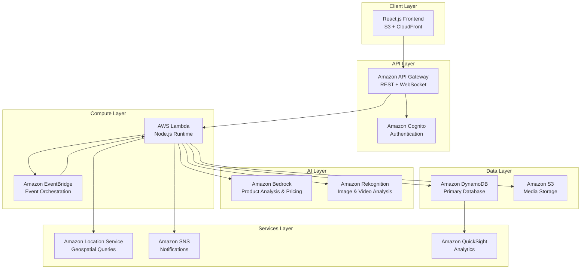
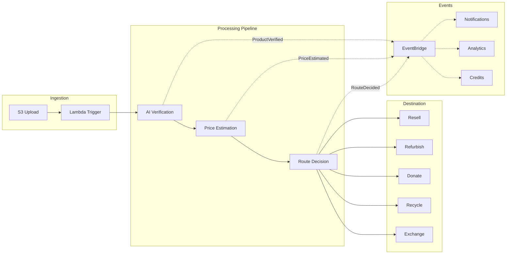
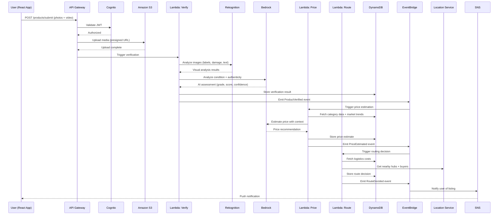
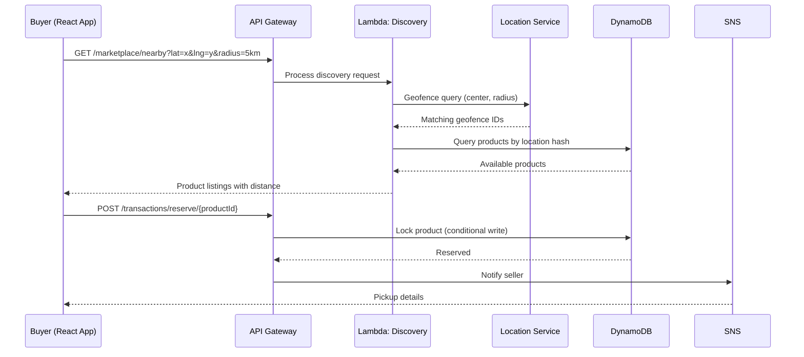

# Design Document: Circular Commerce Platform

## Overview

The Circular Commerce Platform is an AI-powered system within Amazon that intelligently routes returned, underused, and discarded products to their most valuable and sustainable destination — Resell, Refurbish, Donate, Recycle, or Exchange. The platform leverages computer vision, large language models, and optimization algorithms to verify product condition, estimate fair pricing, and match products with nearby buyers through a hyperlocal marketplace.

The system operates on a fully serverless AWS-native architecture using Lambda functions orchestrated by EventBridge, with DynamoDB for storage, Amazon Bedrock for AI reasoning, Amazon Rekognition for visual analysis, and Amazon Location Service for proximity-based discovery. The platform minimizes logistics costs by prioritizing local transactions (self-pickup within 5 km) and batch collection for low-value items, while maximizing recovery value through dynamic routing decisions.

Green Credits incentivize sustainable behavior — users earn credits for selling unused products, buying refurbished items, donating, recycling, and avoiding unnecessary returns. This creates a closed-loop economy where environmental impact becomes a first-class optimization dimension alongside revenue recovery.

## Architecture

### System Architecture Overview



### Event-Driven Architecture Flow



## Sequence Diagrams

### Product Submission Flow



### Hyperlocal Discovery Flow



## Components and Interfaces

### Component 1: Product Verification Service

**Purpose**: Analyzes uploaded media to verify product identity, assess physical condition, detect damage, confirm functionality, and authenticate the product.

**Interface**:
```typescript
interface IProductVerificationService {
  verifyProduct(request: VerificationRequest): Promise<VerificationResult>;
  analyzeImages(imageKeys: string[]): Promise<ImageAnalysis[]>;
  analyzeVideo(videoKey: string): Promise<VideoAnalysis>;
  assessCondition(analyses: MediaAnalysis): Promise<ConditionAssessment>;
}

interface VerificationRequest {
  productId: string;
  userId: string;
  imageKeys: string[];        // S3 keys for product photos
  videoKey: string;           // S3 key for functionality video
  declaredCategory: string;
  declaredBrand?: string;
  declaredModel?: string;
}

interface VerificationResult {
  productId: string;
  conditionScore: number;     // 0-100
  grade: 'A' | 'B' | 'C' | 'D';
  working: boolean;
  confidence: number;         // 0-1
  damageDetected: DamageReport[];
  authenticityScore: number;  // 0-1
  verifiedAt: string;         // ISO timestamp
}
```

**Responsibilities**:
- Orchestrate image and video analysis through Rekognition
- Synthesize visual findings through Bedrock for condition grading
- Detect counterfeit indicators and flag suspicious items
- Generate damage reports with location mapping

### Component 2: AI Price Estimation Service

**Purpose**: Determines fair resale value based on product attributes, condition, market demand, comparable listings, and historical trends.

**Interface**:
```typescript
interface IPriceEstimationService {
  estimatePrice(request: PriceRequest): Promise<PriceEstimate>;
  getMarketComparables(category: string, condition: string): Promise<Comparable[]>;
  getHistoricalTrends(category: string): Promise<TrendData>;
}

interface PriceRequest {
  productId: string;
  category: string;
  brand: string;
  model: string;
  originalPrice: number;
  ageMonths: number;
  conditionScore: number;
  grade: string;
  working: boolean;
  location: GeoPoint;
}

interface PriceEstimate {
  productId: string;
  recommendedPrice: number;
  priceRange: { min: number; max: number };
  confidence: number;
  factors: PriceFactor[];
  estimatedDaysToSell: number;
}
```

**Responsibilities**:
- Aggregate market data for comparable products
- Factor in condition degradation curves by category
- Adjust for local demand using geospatial data
- Provide confidence-bounded price ranges

### Component 3: Hyperlocal Marketplace Service

**Purpose**: Lists verified products to nearby users within a configurable radius, manages product discovery, and facilitates self-pickup transactions.

**Interface**:
```typescript
interface IMarketplaceService {
  listProduct(listing: ProductListing): Promise<ListingResult>;
  discoverNearby(query: DiscoveryQuery): Promise<DiscoveryResult>;
  reserveProduct(productId: string, buyerId: string): Promise<Reservation>;
  completeTransaction(transactionId: string): Promise<TransactionResult>;
}

interface DiscoveryQuery {
  latitude: number;
  longitude: number;
  radiusKm: number;           // default 5
  category?: string;
  priceRange?: { min: number; max: number };
  minCondition?: number;
  sortBy: 'distance' | 'price' | 'condition' | 'recency';
  limit: number;
  cursor?: string;
}

interface DiscoveryResult {
  products: NearbyProduct[];
  nextCursor?: string;
  totalCount: number;
}
```

**Responsibilities**:
- Index products by geohash for efficient spatial queries
- Manage product lifecycle (listed → reserved → sold/expired)
- Handle concurrent reservation conflicts with DynamoDB conditional writes
- Calculate and display distance to each product

### Component 4: AI Routing Engine

**Purpose**: Determines the optimal destination for each product based on condition, economics, logistics costs, demand, and environmental impact.

**Interface**:
```typescript
interface IRoutingEngine {
  determineRoute(request: RoutingRequest): Promise<RoutingDecision>;
  calculateRecoveryValue(product: ProductData): Promise<RecoveryAnalysis>;
  optimizeBatchRouting(products: ProductData[]): Promise<BatchRoutingPlan>;
}

interface RoutingRequest {
  productId: string;
  conditionScore: number;
  grade: string;
  category: string;
  estimatedPrice: number;
  location: GeoPoint;
  weight: number;
  dimensions: Dimensions;
}

interface RoutingDecision {
  productId: string;
  destination: 'resell' | 'refurbish' | 'donate' | 'recycle' | 'exchange';
  recoveryValue: number;
  logisticsCost: number;
  netValue: number;
  confidence: number;
  reasoning: string;
  alternativeRoutes: AlternativeRoute[];
}
```

**Responsibilities**:
- Execute routing algorithm with dynamic thresholds
- Calculate full recovery value including all logistics costs
- Suggest batch collection when individual transport is uneconomical
- Optimize across multiple dimensions (value, sustainability, speed)

### Component 5: Green Credits Service

**Purpose**: Manages the incentive system that rewards users for sustainable actions with redeemable credits.

**Interface**:
```typescript
interface IGreenCreditsService {
  awardCredits(action: CreditAction): Promise<CreditAward>;
  getBalance(userId: string): Promise<CreditBalance>;
  redeemCredits(redemption: RedemptionRequest): Promise<RedemptionResult>;
  getLeaderboard(scope: 'local' | 'global'): Promise<LeaderboardEntry[]>;
}

interface CreditAction {
  userId: string;
  actionType: 'sell' | 'buy_refurbished' | 'donate' | 'recycle' | 'avoid_return';
  productId: string;
  metadata: Record<string, unknown>;
}

interface CreditBalance {
  userId: string;
  totalCredits: number;
  lifetimeEarned: number;
  lifetimeRedeemed: number;
  tier: 'bronze' | 'silver' | 'gold' | 'platinum';
  co2SavedKg: number;
}
```

**Responsibilities**:
- Calculate credit amounts based on action type and impact
- Track environmental impact metrics (CO2 saved, waste diverted)
- Manage tier progression and unlock rewards
- Provide redemption against Amazon discounts and rewards

### Component 6: Batch Collection Service

**Purpose**: Optimizes logistics for low-value products by consolidating them at local hubs before batch transport to processing centers.

**Interface**:
```typescript
interface IBatchCollectionService {
  assignToHub(product: ProductData): Promise<HubAssignment>;
  getHubStatus(hubId: string): Promise<HubStatus>;
  triggerBatchPickup(hubId: string): Promise<BatchPickup>;
  optimizeHubNetwork(): Promise<NetworkOptimization>;
}

interface HubAssignment {
  productId: string;
  hubId: string;
  hubLocation: GeoPoint;
  distanceFromUser: number;
  estimatedBatchDate: string;
  batchSize: number;
}
```

**Responsibilities**:
- Identify nearest collection hub for each product
- Determine optimal batch size before triggering transport
- Calculate break-even thresholds for batch vs. individual transport
- Monitor hub capacity and trigger overflow routing

## Data Models

### Product Model

```typescript
interface Product {
  PK: string;                  // PRODUCT#{productId}
  SK: string;                  // METADATA
  productId: string;           // UUID
  userId: string;              // Owner user ID
  category: string;
  brand: string;
  model: string;
  originalPrice: number;
  ageMonths: number;
  status: ProductStatus;
  mediaKeys: {
    images: string[];
    video: string;
  };
  verification: VerificationResult;
  priceEstimate: PriceEstimate;
  routingDecision: RoutingDecision;
  location: {
    latitude: number;
    longitude: number;
    geohash: string;           // 6-char geohash for spatial indexing
    city: string;
  };
  createdAt: string;
  updatedAt: string;
  expiresAt: number;           // TTL for auto-expiry
  
  // GSI keys
  GSI1PK: string;             // GEOHASH#{geohash4}
  GSI1SK: string;             // STATUS#LISTED#{createdAt}
  GSI2PK: string;             // USER#{userId}
  GSI2SK: string;             // CREATED#{createdAt}
  GSI3PK: string;             // CATEGORY#{category}
  GSI3SK: string;             // PRICE#{recommendedPrice}
}

type ProductStatus = 
  | 'pending_verification'
  | 'verified'
  | 'listed'
  | 'reserved'
  | 'sold'
  | 'donated'
  | 'recycled'
  | 'expired';
```

**Validation Rules**:
- `productId` must be a valid UUID v4
- `category` must be from the approved category taxonomy
- `originalPrice` must be positive
- `ageMonths` must be non-negative
- `location.latitude` must be between -90 and 90
- `location.longitude` must be between -180 and 180
- `mediaKeys.images` must have 2-10 entries
- `mediaKeys.video` must be present and under 60 seconds

### Transaction Model

```typescript
interface Transaction {
  PK: string;                  // TRANSACTION#{transactionId}
  SK: string;                  // METADATA
  transactionId: string;
  productId: string;
  sellerId: string;
  buyerId: string;
  status: TransactionStatus;
  agreedPrice: number;
  pickupLocation: GeoPoint;
  pickupWindow: {
    start: string;
    end: string;
  };
  completedAt?: string;
  creditsAwarded: {
    seller: number;
    buyer: number;
  };
  createdAt: string;
  updatedAt: string;
}

type TransactionStatus =
  | 'reserved'
  | 'pickup_scheduled'
  | 'completed'
  | 'cancelled'
  | 'disputed';
```

**Validation Rules**:
- `sellerId` and `buyerId` must be different
- `agreedPrice` must be within 80-120% of `recommendedPrice`
- `pickupWindow` duration must be between 1-72 hours
- `status` transitions must follow valid state machine

### User Credits Model

```typescript
interface UserCredits {
  PK: string;                  // USER#{userId}
  SK: string;                  // CREDITS
  userId: string;
  totalCredits: number;
  lifetimeEarned: number;
  lifetimeRedeemed: number;
  tier: 'bronze' | 'silver' | 'gold' | 'platinum';
  co2SavedKg: number;
  wasteDisvertedKg: number;
  actions: CreditAction[];     // Last 50 actions
  tierProgress: {
    current: number;
    nextTierAt: number;
  };
}
```

### DynamoDB Table Design

```typescript
// Single-table design with GSIs
const tableSchema = {
  tableName: 'CircularCommercePlatform',
  partitionKey: 'PK',
  sortKey: 'SK',
  globalSecondaryIndexes: [
    {
      indexName: 'GSI1-GeoLocation',
      partitionKey: 'GSI1PK',    // GEOHASH#{geohash4}
      sortKey: 'GSI1SK',          // STATUS#LISTED#{timestamp}
    },
    {
      indexName: 'GSI2-UserProducts',
      partitionKey: 'GSI2PK',    // USER#{userId}
      sortKey: 'GSI2SK',          // CREATED#{timestamp}
    },
    {
      indexName: 'GSI3-CategoryPrice',
      partitionKey: 'GSI3PK',    // CATEGORY#{category}
      sortKey: 'GSI3SK',          // PRICE#{price}
    },
  ],
};
```

## Algorithmic Pseudocode

### AI Product Verification Algorithm

```typescript
async function verifyProduct(request: VerificationRequest): Promise<VerificationResult> {
  // Step 1: Parallel image and video analysis
  const [imageAnalyses, videoAnalysis] = await Promise.all([
    analyzeImagesWithRekognition(request.imageKeys),
    analyzeVideoWithRekognition(request.videoKey),
  ]);

  // Step 2: Extract condition indicators
  const damageIndicators = extractDamageIndicators(imageAnalyses);
  const functionalIndicators = extractFunctionalIndicators(videoAnalysis);
  const labelMatches = matchProductLabels(imageAnalyses, request.declaredCategory);

  // Step 3: Synthesize with Bedrock for holistic assessment
  const bedrockPrompt = buildVerificationPrompt({
    damageIndicators,
    functionalIndicators,
    labelMatches,
    declaredProduct: {
      category: request.declaredCategory,
      brand: request.declaredBrand,
      model: request.declaredModel,
    },
  });

  const aiAssessment = await invokeBedrockModel(bedrockPrompt);

  // Step 4: Calculate condition score
  const conditionScore = calculateConditionScore({
    surfaceDamage: damageIndicators.surfaceScore,
    structuralIntegrity: damageIndicators.structuralScore,
    functionalStatus: functionalIndicators.workingScore,
    completeness: labelMatches.completenessScore,
    aiAdjustment: aiAssessment.adjustmentFactor,
  });

  // Step 5: Determine grade
  const grade = scoreToGrade(conditionScore);
  const working = functionalIndicators.workingScore > 0.7;
  const confidence = calculateConfidence(imageAnalyses, videoAnalysis, aiAssessment);

  return {
    productId: request.productId,
    conditionScore,
    grade,
    working,
    confidence,
    damageDetected: damageIndicators.damages,
    authenticityScore: aiAssessment.authenticityScore,
    verifiedAt: new Date().toISOString(),
  };
}
```

**Preconditions:**
- `request.imageKeys` contains 2-10 valid S3 keys pointing to accessible images
- `request.videoKey` points to an accessible video file under 60 seconds
- All media has been virus-scanned and validated for format
- User is authenticated and owns the product submission

**Postconditions:**
- Returns `VerificationResult` with `conditionScore` in range [0, 100]
- `grade` is one of A (90-100), B (70-89), C (40-69), D (0-39)
- `confidence` is in range [0, 1]
- `authenticityScore` is in range [0, 1]
- Result is persisted to DynamoDB before returning
- `ProductVerified` event is emitted to EventBridge

**Loop Invariants:** N/A (no iterative loops)

---

### AI Price Estimation Algorithm

```typescript
async function estimatePrice(request: PriceRequest): Promise<PriceEstimate> {
  // Step 1: Gather market intelligence
  const [comparables, trends, localDemand] = await Promise.all([
    getMarketComparables(request.category, request.brand, request.model),
    getHistoricalTrends(request.category, request.ageMonths),
    getLocalDemand(request.location, request.category),
  ]);

  // Step 2: Calculate base depreciation
  const depreciationCurve = getCategoryDepreciationCurve(request.category);
  const baseValue = request.originalPrice * depreciationCurve(request.ageMonths);

  // Step 3: Apply condition adjustment
  const conditionMultiplier = calculateConditionMultiplier(
    request.conditionScore,
    request.grade,
    request.working
  );
  const conditionAdjustedValue = baseValue * conditionMultiplier;

  // Step 4: Apply market adjustment
  const demandMultiplier = calculateDemandMultiplier(localDemand, comparables);
  const marketAdjustedValue = conditionAdjustedValue * demandMultiplier;

  // Step 5: Calculate confidence-bounded range
  const comparablesPrices = comparables.map(c => c.soldPrice);
  const stdDev = calculateStdDev(comparablesPrices);
  const confidence = calculatePriceConfidence(comparables.length, stdDev);

  const recommendedPrice = Math.round(marketAdjustedValue);
  const margin = stdDev * (1 - confidence);
  const priceRange = {
    min: Math.round(recommendedPrice - margin),
    max: Math.round(recommendedPrice + margin),
  };

  // Step 6: Estimate time to sell
  const estimatedDaysToSell = estimateTimeToSell(
    localDemand,
    recommendedPrice,
    request.category
  );

  return {
    productId: request.productId,
    recommendedPrice,
    priceRange,
    confidence,
    factors: buildPriceFactors(depreciationCurve, conditionMultiplier, demandMultiplier),
    estimatedDaysToSell,
  };
}
```

**Preconditions:**
- `request.originalPrice` > 0
- `request.conditionScore` is in range [0, 100]
- `request.ageMonths` >= 0
- `request.location` contains valid latitude and longitude
- Product has been verified (verification result exists)

**Postconditions:**
- `recommendedPrice` > 0
- `priceRange.min` <= `recommendedPrice` <= `priceRange.max`
- `priceRange.min` > 0
- `confidence` is in range [0, 1]
- `estimatedDaysToSell` > 0
- Price factors sum explanation matches the final price derivation

**Loop Invariants:** N/A

---

### AI Routing Engine Algorithm

```typescript
async function determineRoute(request: RoutingRequest): Promise<RoutingDecision> {
  // Step 1: Calculate all possible route costs
  const routes = await Promise.all([
    calculateResellRoute(request),
    calculateRefurbishRoute(request),
    calculateDonateRoute(request),
    calculateRecycleRoute(request),
    calculateExchangeRoute(request),
  ]);

  // Step 2: Apply condition-based primary filter
  const eligibleRoutes = routes.filter(route => {
    switch (route.destination) {
      case 'resell':     return request.conditionScore > 90;
      case 'refurbish':  return request.conditionScore > 70 && request.conditionScore <= 90;
      case 'donate':     return request.conditionScore > 40 && request.conditionScore <= 70;
      case 'recycle':    return request.conditionScore <= 40;
      case 'exchange':   return request.conditionScore > 60;
      default:           return false;
    }
  });

  // Step 3: Calculate Recovery Value for each eligible route
  // Recovery Value = Expected Resale Value - Shipping Cost - Inspection Cost - Repair Cost
  const routesWithRecovery = eligibleRoutes.map(route => ({
    ...route,
    recoveryValue: route.expectedValue - route.shippingCost - route.inspectionCost - route.repairCost,
    netValue: route.expectedValue - route.totalCost,
  }));

  // Step 4: Dynamic optimization with multi-factor scoring
  const scoredRoutes = routesWithRecovery.map(route => ({
    ...route,
    score: calculateRouteScore({
      recoveryValue: route.recoveryValue,
      environmentalImpact: route.co2Saved,
      timeToProcess: route.estimatedDays,
      demandScore: route.localDemand,
      weights: getDynamicWeights(request.category),
    }),
  }));

  // Step 5: Select optimal route
  const sortedRoutes = scoredRoutes.sort((a, b) => b.score - a.score);
  const optimal = sortedRoutes[0];

  // Step 6: If recovery value is negative, suggest alternatives
  if (optimal.recoveryValue < 0) {
    return buildAlternativeDecision(request, sortedRoutes);
  }

  return {
    productId: request.productId,
    destination: optimal.destination,
    recoveryValue: optimal.recoveryValue,
    logisticsCost: optimal.totalCost,
    netValue: optimal.netValue,
    confidence: optimal.confidence,
    reasoning: generateReasoning(optimal),
    alternativeRoutes: sortedRoutes.slice(1, 4).map(toAlternativeRoute),
  };
}
```

**Preconditions:**
- `request.conditionScore` is in range [0, 100]
- `request.estimatedPrice` > 0
- `request.location` is a valid geographic coordinate
- `request.weight` > 0 and `request.dimensions` are positive
- Logistics cost data is available for the request location

**Postconditions:**
- Returns exactly one `destination` from the valid set
- `recoveryValue` = `expectedValue` - total logistics costs
- `alternativeRoutes` contains at most 3 entries
- If `conditionScore` > 90, `destination` is 'resell' (unless negative recovery)
- `reasoning` is a non-empty human-readable explanation
- `RouteDecided` event is emitted to EventBridge

**Loop Invariants:**
- For route scoring loop: all previously scored routes have valid non-null scores
- For filtering loop: filtered routes all meet their condition threshold

---

### Hyperlocal Discovery Algorithm

```typescript
async function discoverNearby(query: DiscoveryQuery): Promise<DiscoveryResult> {
  // Step 1: Calculate geohash prefix for spatial query
  const geohashPrefix = calculateGeohash(query.latitude, query.longitude, 4);
  const adjacentHashes = getAdjacentGeohashes(geohashPrefix);
  const searchHashes = [geohashPrefix, ...adjacentHashes];

  // Step 2: Query DynamoDB GSI1 for each geohash prefix
  const allProducts: Product[] = [];
  
  for (const hash of searchHashes) {
    // Loop Invariant: allProducts contains only valid, listed products from previously queried hashes
    const products = await queryProductsByGeohash(hash, {
      status: 'listed',
      category: query.category,
      priceRange: query.priceRange,
      minCondition: query.minCondition,
      limit: query.limit * 2, // Over-fetch to account for distance filtering
      cursor: query.cursor,
    });
    allProducts.push(...products);
  }

  // Step 3: Precise distance filtering (geohash is approximate)
  const productsWithDistance = allProducts
    .map(product => ({
      ...product,
      distance: haversineDistance(
        query.latitude, query.longitude,
        product.location.latitude, product.location.longitude
      ),
    }))
    .filter(p => p.distance <= query.radiusKm);

  // Step 4: Sort by user preference
  const sorted = sortProducts(productsWithDistance, query.sortBy);

  // Step 5: Paginate
  const paginated = sorted.slice(0, query.limit);
  const nextCursor = paginated.length === query.limit 
    ? encodeCursor(paginated[paginated.length - 1]) 
    : undefined;

  return {
    products: paginated.map(toNearbyProduct),
    nextCursor,
    totalCount: productsWithDistance.length,
  };
}
```

**Preconditions:**
- `query.latitude` is in range [-90, 90]
- `query.longitude` is in range [-180, 180]
- `query.radiusKm` > 0 and <= 50
- `query.limit` > 0 and <= 100

**Postconditions:**
- All returned products have `distance` <= `query.radiusKm`
- Products are sorted according to `query.sortBy`
- Result count <= `query.limit`
- `nextCursor` is present iff more results exist
- No expired or non-listed products are returned

**Loop Invariants:**
- `allProducts` contains only products with status 'listed' from previously queried geohash prefixes
- All products in `allProducts` match the category and price filters (if specified)

---

### Batch Collection Optimization Algorithm

```typescript
async function optimizeBatchCollection(
  products: ProductData[],
  hubs: Hub[]
): Promise<BatchCollectionPlan> {
  // Step 1: Assign each product to nearest hub
  const assignments: Map<string, ProductData[]> = new Map();
  
  for (const product of products) {
    // Loop Invariant: all previously assigned products are mapped to their nearest hub
    const nearestHub = findNearestHub(product.location, hubs);
    const existing = assignments.get(nearestHub.hubId) || [];
    existing.push(product);
    assignments.set(nearestHub.hubId, existing);
  }

  // Step 2: Determine batch readiness for each hub
  const batchPlans: BatchPlan[] = [];
  
  for (const [hubId, hubProducts] of assignments) {
    // Loop Invariant: all previously evaluated hubs have a valid batch plan
    const hub = hubs.find(h => h.hubId === hubId)!;
    const totalWeight = hubProducts.reduce((sum, p) => sum + p.weight, 0);
    const totalValue = hubProducts.reduce((sum, p) => sum + p.estimatedPrice, 0);

    // Calculate break-even: batch transport cost vs. total recovery value
    const batchTransportCost = calculateBatchTransportCost(hub, totalWeight);
    const individualTransportCost = hubProducts.reduce(
      (sum, p) => sum + calculateIndividualTransportCost(p, hub), 0
    );

    const savings = individualTransportCost - batchTransportCost;
    const isViable = savings > 0 && hubProducts.length >= hub.minBatchSize;

    batchPlans.push({
      hubId,
      products: hubProducts,
      totalWeight,
      totalValue,
      batchTransportCost,
      savings,
      isViable,
      estimatedPickupDate: isViable 
        ? calculateNextPickupDate(hub) 
        : null,
    });
  }

  return {
    plans: batchPlans,
    totalSavings: batchPlans.reduce((sum, p) => sum + Math.max(0, p.savings), 0),
    viableBatches: batchPlans.filter(p => p.isViable).length,
  };
}
```

**Preconditions:**
- `products` is non-empty array
- `hubs` contains at least one hub
- All products have valid `location`, `weight`, and `estimatedPrice`
- All hubs have valid `location` and `minBatchSize`

**Postconditions:**
- Every product is assigned to exactly one hub
- `totalSavings` >= 0
- `viableBatches` >= 0 and <= number of hubs
- Viable batches have `savings` > 0 and meet minimum batch size
- Each hub assignment uses the nearest hub by haversine distance

**Loop Invariants:**
- Assignment loop: all previously assigned products are mapped to their geographically nearest hub
- Batch planning loop: all previously evaluated hubs have complete cost calculations

---

### Green Credits Calculation Algorithm

```typescript
async function awardCredits(action: CreditAction): Promise<CreditAward> {
  // Step 1: Determine base credit amount by action type
  const baseCreditTable: Record<string, number> = {
    sell: 50,
    buy_refurbished: 30,
    donate: 40,
    recycle: 20,
    avoid_return: 60,
  };
  const baseCredits = baseCreditTable[action.actionType] || 0;

  // Step 2: Apply multipliers based on impact
  const product = await getProduct(action.productId);
  const impactMultiplier = calculateImpactMultiplier(product, action.actionType);
  const tierMultiplier = await getUserTierMultiplier(action.userId);
  
  const totalCredits = Math.round(baseCredits * impactMultiplier * tierMultiplier);

  // Step 3: Calculate environmental impact
  const co2Saved = calculateCO2Saved(product, action.actionType);
  const wasteDiverted = product.weight; // kg diverted from landfill

  // Step 4: Update user balance (atomic DynamoDB update)
  const updatedBalance = await atomicCreditUpdate(action.userId, {
    creditsToAdd: totalCredits,
    co2ToAdd: co2Saved,
    wasteToAdd: wasteDiverted,
  });

  // Step 5: Check tier progression
  const newTier = calculateTier(updatedBalance.lifetimeEarned);
  if (newTier !== updatedBalance.tier) {
    await updateUserTier(action.userId, newTier);
    await emitTierUpEvent(action.userId, newTier);
  }

  return {
    userId: action.userId,
    creditsAwarded: totalCredits,
    newBalance: updatedBalance.totalCredits,
    co2SavedKg: co2Saved,
    tierProgress: {
      current: updatedBalance.lifetimeEarned,
      nextTierAt: getNextTierThreshold(newTier),
    },
  };
}
```

**Preconditions:**
- `action.userId` is a valid, authenticated user
- `action.actionType` is one of: 'sell', 'buy_refurbished', 'donate', 'recycle', 'avoid_return'
- `action.productId` references a valid product
- The action has not already been credited (idempotency check)

**Postconditions:**
- `creditsAwarded` >= 0
- `newBalance` = previous balance + `creditsAwarded`
- `co2SavedKg` >= 0
- If tier changed, `TierUp` event is emitted
- Credit update is atomic (no partial updates)
- Action is recorded for audit trail

**Loop Invariants:** N/A

## Key Functions with Formal Specifications

### calculateConditionScore()

```typescript
function calculateConditionScore(indicators: ConditionIndicators): number {
  const weights = {
    surfaceDamage: 0.25,
    structuralIntegrity: 0.30,
    functionalStatus: 0.30,
    completeness: 0.10,
    aiAdjustment: 0.05,
  };

  const rawScore = 
    indicators.surfaceDamage * weights.surfaceDamage +
    indicators.structuralIntegrity * weights.structuralIntegrity +
    indicators.functionalStatus * weights.functionalStatus +
    indicators.completeness * weights.completeness +
    indicators.aiAdjustment * weights.aiAdjustment;

  return Math.round(Math.max(0, Math.min(100, rawScore * 100)));
}
```

**Preconditions:**
- All indicator values are in range [0, 1]
- Weights sum to 1.0

**Postconditions:**
- Returns integer in range [0, 100]
- Higher scores indicate better condition
- Score is deterministic for same inputs

---

### haversineDistance()

```typescript
function haversineDistance(
  lat1: number, lon1: number, 
  lat2: number, lon2: number
): number {
  const R = 6371; // Earth's radius in km
  const dLat = toRadians(lat2 - lat1);
  const dLon = toRadians(lon2 - lon1);
  
  const a = 
    Math.sin(dLat / 2) * Math.sin(dLat / 2) +
    Math.cos(toRadians(lat1)) * Math.cos(toRadians(lat2)) *
    Math.sin(dLon / 2) * Math.sin(dLon / 2);
  
  const c = 2 * Math.atan2(Math.sqrt(a), Math.sqrt(1 - a));
  return R * c;
}
```

**Preconditions:**
- `lat1`, `lat2` are in range [-90, 90]
- `lon1`, `lon2` are in range [-180, 180]

**Postconditions:**
- Returns distance in kilometers >= 0
- `haversineDistance(x, y, x, y) === 0` (identity)
- `haversineDistance(a, b, c, d) === haversineDistance(c, d, a, b)` (symmetry)
- Result <= 20015 km (half Earth circumference)

---

### scoreToGrade()

```typescript
function scoreToGrade(conditionScore: number): 'A' | 'B' | 'C' | 'D' {
  if (conditionScore >= 90) return 'A';
  if (conditionScore >= 70) return 'B';
  if (conditionScore >= 40) return 'C';
  return 'D';
}
```

**Preconditions:**
- `conditionScore` is in range [0, 100]

**Postconditions:**
- Returns exactly one of 'A', 'B', 'C', 'D'
- Grading is monotonically non-decreasing (higher score → same or better grade)
- Boundaries: A=[90,100], B=[70,89], C=[40,69], D=[0,39]

---

### calculateRecoveryValue()

```typescript
function calculateRecoveryValue(
  expectedResaleValue: number,
  shippingCost: number,
  inspectionCost: number,
  repairCost: number
): number {
  return expectedResaleValue - shippingCost - inspectionCost - repairCost;
}
```

**Preconditions:**
- `expectedResaleValue` >= 0
- `shippingCost` >= 0
- `inspectionCost` >= 0
- `repairCost` >= 0

**Postconditions:**
- Result can be negative (indicates uneconomical recovery)
- If result > 0, product should be processed
- If result <= 0, alternative routing should be suggested

## Example Usage

### Complete Product Submission Workflow

```typescript
// Example 1: Priya's returned shoes (₹500, 600 km from processing center)
const submission = await submitProduct({
  userId: 'user-priya-123',
  category: 'footwear',
  brand: 'Nike',
  model: 'Air Max 90',
  originalPrice: 500,
  ageMonths: 3,
  images: ['shoe-front.jpg', 'shoe-back.jpg', 'shoe-sole.jpg'],
  video: 'shoe-demo.mp4',
  location: { latitude: 12.9716, longitude: 77.5946 }, // Bangalore
});

// Result: conditionScore=85, grade=B, working=true
// Route: Resell locally (recovery value positive within 5km)
// Avoids: 600km shipping to processing center

// Example 2: Rahul's baby monitor (underused, excellent condition)
const listing = await submitProduct({
  userId: 'user-rahul-456',
  category: 'electronics',
  brand: 'Philips',
  model: 'Avent SCD843',
  originalPrice: 8999,
  ageMonths: 8,
  images: ['monitor-1.jpg', 'monitor-2.jpg', 'monitor-box.jpg'],
  video: 'monitor-working.mp4',
  location: { latitude: 19.0760, longitude: 72.8777 }, // Mumbai
});

// Result: conditionScore=95, grade=A, working=true
// Price: ₹5,400 (range: ₹4,800 - ₹6,000)
// Route: Resell on hyperlocal marketplace
// 12 interested buyers within 5 km

// Example 3: Discarded laptop (needs repair assessment)
const laptop = await submitProduct({
  userId: 'user-customer-789',
  category: 'electronics',
  brand: 'Dell',
  model: 'Inspiron 15',
  originalPrice: 45000,
  ageMonths: 36,
  images: ['laptop-open.jpg', 'laptop-closed.jpg', 'laptop-screen.jpg', 'laptop-ports.jpg'],
  video: 'laptop-boot.mp4',
  location: { latitude: 28.7041, longitude: 77.1025 }, // Delhi
});

// Result: conditionScore=55, grade=C, working=false
// Recovery Analysis:
//   - Resale Value (after repair): ₹12,000
//   - Repair Cost: ₹4,000
//   - Shipping to refurb center: ₹800
//   - Recovery Value: ₹7,200
// Route: Refurbish (positive recovery value)
```

### Nearby Discovery Example

```typescript
// Buyer searching for electronics within 5 km
const nearby = await discoverNearby({
  latitude: 12.9716,
  longitude: 77.5946,
  radiusKm: 5,
  category: 'electronics',
  priceRange: { min: 1000, max: 10000 },
  minCondition: 70,
  sortBy: 'distance',
  limit: 20,
});

// Returns: 8 products, nearest at 0.3 km, farthest at 4.7 km
```

### Green Credits Example

```typescript
// User sells a product locally (avoids shipping)
const credits = await awardCredits({
  userId: 'user-priya-123',
  actionType: 'sell',
  productId: 'product-abc',
  metadata: { avoidedShippingKm: 600 },
});

// Result: 75 credits (50 base * 1.5 impact multiplier)
// CO2 saved: 2.4 kg
// New balance: 350 credits
// Tier: Silver (next tier at 500)
```

## Correctness Properties

*A property is a characteristic or behavior that should hold true across all valid executions of a system — essentially, a formal statement about what the system should do. Properties serve as the bridge between human-readable specifications and machine-verifiable correctness guarantees.*

### Property 1: Condition Score Bounded Output

*For any* set of condition indicators where each indicator is in range [0, 1], the calculated condition score SHALL be an integer in the range [0, 100], computed as the weighted sum: surface damage (25%) + structural integrity (30%) + functional status (30%) + completeness (10%) + AI adjustment (5%), scaled to 100.

**Validates: Requirements 2.3, 2.8**

### Property 2: Grade Mapping Consistency

*For any* condition score in [0, 100], the grade assignment SHALL follow: A for scores 90-100, B for 70-89, C for 40-69, D for 0-39. Additionally, if score(A) > score(B), then grade(A) >= grade(B) (monotonicity).

**Validates: Requirements 2.4, 2.5, 2.6, 2.7**

### Property 3: Verification Determinism

*For any* identical set of condition indicators, the `calculateConditionScore` function SHALL produce identical condition scores and grades across repeated invocations.

**Validates: Requirements 2.9**

### Property 4: Price Bound Validity

*For any* valid product with positive original price and non-negative age, the price estimation SHALL produce: 0 < priceRange.min <= recommendedPrice <= priceRange.max.

**Validates: Requirements 3.2, 3.3, 3.4**

### Property 5: Spatial Correctness

*For any* discovery query and any product returned in the results, the haversine distance from the query center to the product location SHALL be less than or equal to the query radius.

**Validates: Requirements 5.1**

### Property 6: Distance Symmetry

*For any* two valid geographic coordinates A and B, haversineDistance(A, B) SHALL equal haversineDistance(B, A).

**Validates: Requirements 5.3**

### Property 7: Discovery Result Ordering

*For any* discovery query that specifies a sort order, the returned product list SHALL be sorted according to the specified preference (distance, price, condition, or recency).

**Validates: Requirements 5.4**

### Property 8: Discovery Result Bounds

*For any* discovery query, the number of returned products SHALL be at most the specified limit and never exceed 100. Only products with status 'listed' SHALL appear in results.

**Validates: Requirements 5.5, 5.6**

### Property 9: Recovery Value Additivity

*For any* set of cost inputs (expected resale value, shipping, inspection, repair), the recovery value SHALL equal expectedResaleValue - shippingCost - inspectionCost - repairCost with no hidden costs.

**Validates: Requirements 4.6**

### Property 10: Routing Eligibility Consistency

*For any* product, the routing engine SHALL enforce condition-based eligibility: resell requires score > 90, refurbish requires score in (70, 90], donate requires score in (40, 70], recycle requires score <= 40, exchange requires score > 60. If score > 90 and recovery value is positive, the destination SHALL be 'resell'.

**Validates: Requirements 4.1, 4.2, 4.3, 4.4, 4.5**

### Property 11: Routing Output Validity

*For any* routing decision, the reasoning field SHALL be a non-empty string, and the alternative routes list SHALL contain at most 3 entries.

**Validates: Requirements 4.8, 4.9**

### Property 12: Negative Recovery Alternatives

*For any* product where the optimal route yields a negative recovery value, the routing engine SHALL suggest alternative destinations rather than proceeding with the negative-value route.

**Validates: Requirements 4.7**

### Property 13: Transaction Isolation

*For any* product, at most one reservation can succeed at a time. If two buyers attempt to reserve the same product simultaneously, exactly one reservation SHALL succeed and the other SHALL fail.

**Validates: Requirements 6.1, 6.2**

### Property 14: Transaction Validation Constraints

*For any* transaction, the seller and buyer SHALL be different users, the agreed price SHALL be within 80-120% of the recommended price, and the pickup window duration SHALL be between 1 and 72 hours.

**Validates: Requirements 6.4, 6.5, 6.6**

### Property 15: Credit Non-Negativity

*For any* valid sustainable action, credits awarded SHALL be greater than or equal to zero, and the user's total credit balance SHALL never be negative.

**Validates: Requirements 7.2, 7.3**

### Property 16: Credit Idempotency

*For any* user, product, and action type tuple, awarding credits SHALL succeed at most once. Repeated awards for the same tuple SHALL not change the balance.

**Validates: Requirements 7.4**

### Property 17: Credit and Tier Monotonicity

*For any* sequence of credit operations on a user account, lifetime earned credits SHALL never decrease, and the tier SHALL only advance (never regress).

**Validates: Requirements 7.8, 7.9**

### Property 18: Batch Hub Assignment Completeness

*For any* set of products and hubs, every product SHALL be assigned to exactly one hub, and that hub SHALL be the geographically nearest hub by haversine distance.

**Validates: Requirements 8.1, 8.2**

### Property 19: Batch Savings Guarantee

*For any* viable batch (meets minimum batch size and batch transport cost < sum of individual costs), the savings SHALL be positive. Total savings across all batches SHALL be non-negative.

**Validates: Requirements 8.3, 8.4, 8.5**

### Property 20: Input Validation Completeness

*For any* API input, the platform SHALL validate: product IDs as UUID v4, categories against taxonomy, original price as positive, age as non-negative, latitude in [-90, 90], longitude in [-180, 180]. Invalid inputs SHALL be rejected before any business logic executes.

**Validates: Requirements 9.1, 9.2, 9.3, 9.4, 9.5, 9.6, 9.8**

### Property 21: Media Submission Bounds

*For any* product submission, the platform SHALL accept exactly 2-10 photos and require a video under 60 seconds. Submissions outside these bounds SHALL be rejected.

**Validates: Requirements 1.1, 1.2, 1.3**

### Property 22: Ownership Authorization

*For any* product modification request, the platform SHALL enforce that only the product owner can modify their own products. Requests from non-owners SHALL be rejected.

**Validates: Requirements 10.2**

## Error Handling

### Error Scenario 1: Media Analysis Failure

**Condition**: Rekognition or Bedrock returns an error or timeout during product verification
**Response**: Retry with exponential backoff (max 3 attempts). If all retries fail, mark product as `pending_manual_review` and notify ops team.
**Recovery**: Manual review queue processes within 24 hours. User is notified of delay.

### Error Scenario 2: Concurrent Reservation Conflict

**Condition**: Two buyers attempt to reserve the same product simultaneously
**Response**: DynamoDB conditional write ensures only one succeeds. The losing request receives a `ConditionalCheckFailedException`.
**Recovery**: Return "Product no longer available" to the losing buyer. Suggest similar nearby products.

### Error Scenario 3: Negative Recovery Value

**Condition**: All routing options yield negative recovery value (product is uneconomical to process)
**Response**: Suggest alternatives in priority order: (1) Local resale at reduced price, (2) Batch collection at nearest hub, (3) Donation to registered partner, (4) Recycling.
**Recovery**: User chooses alternative. Green credits awarded regardless to incentivize participation.

### Error Scenario 4: Location Service Unavailable

**Condition**: Amazon Location Service is temporarily unavailable for geospatial queries
**Response**: Fall back to DynamoDB geohash-based queries without precise distance filtering. Results may include products slightly outside radius.
**Recovery**: Background job re-validates distances when service recovers. Listings are approximate during outage.

### Error Scenario 5: Price Data Insufficient

**Condition**: Fewer than 3 comparable products found for price estimation
**Response**: Widen search criteria (broader category, wider geography). If still insufficient, use depreciation-only model with lower confidence score.
**Recovery**: Flag low-confidence prices for seller review. Allow seller to set custom price within ±30% of estimate.

### Error Scenario 6: S3 Upload Failure

**Condition**: Media upload to S3 fails (network error, size limit exceeded, invalid format)
**Response**: Return specific error code. For network errors, provide resumable upload URL. For format errors, specify accepted formats.
**Recovery**: Client retries with exponential backoff. Partial uploads are cleaned up by S3 lifecycle rule after 24 hours.

## Testing Strategy

### Unit Testing Approach

- Test all pure functions (`calculateConditionScore`, `haversineDistance`, `scoreToGrade`, `calculateRecoveryValue`) with boundary values
- Mock AWS service calls (Rekognition, Bedrock, DynamoDB, Location Service)
- Test state machine transitions for product and transaction lifecycle
- Validate all data model schemas with edge cases
- Target: 90%+ line coverage for business logic

### Property-Based Testing Approach

**Property Test Library**: fast-check

Key properties to test:
- `conditionScore` always in [0, 100] for any valid indicators
- `grade` is monotonically consistent with score
- `haversineDistance` satisfies triangle inequality
- Price ranges always contain the recommended price
- Geohash queries never miss products within the target radius
- Credit calculations never produce negative balances
- Routing decisions are consistent with condition thresholds

### Integration Testing Approach

- End-to-end product submission flow with LocalStack (DynamoDB, S3, Lambda)
- Concurrent reservation stress testing
- Geospatial query accuracy validation against known coordinates
- EventBridge event propagation verification
- Batch collection threshold triggers

## Performance Considerations

- **DynamoDB Capacity**: Use on-demand capacity mode for unpredictable traffic patterns. Single-table design minimizes cross-partition queries.
- **Geospatial Indexing**: 4-character geohash prefix (~39 km² cells) balances query distribution with precision. Adjacent hash queries ensure no boundary misses.
- **Lambda Cold Starts**: Use provisioned concurrency for verification and pricing lambdas during peak hours. Keep function bundles under 5 MB.
- **Media Processing**: Presigned URLs bypass API Gateway for large uploads. Process images in parallel (Promise.all).
- **Caching**: Cache category depreciation curves, hub locations, and demand data in Lambda memory (5-minute TTL).
- **Pagination**: Cursor-based pagination prevents full table scans. Limit results to 100 per query.

## Security Considerations

- **Authentication**: All API endpoints require valid Cognito JWT. Scoped permissions per user role (seller, buyer, admin).
- **Authorization**: Users can only modify their own products. Conditional expressions enforce ownership in DynamoDB writes.
- **Media Validation**: All uploads scanned for malware before processing. Max file sizes enforced at API Gateway level.
- **PII Protection**: User location stored as geohash (approximate), not exact coordinates in marketplace listings. Exact location shared only after transaction agreement.
- **Rate Limiting**: API Gateway throttling (100 req/s per user). Verification submissions limited to 10/day per user.
- **Data Encryption**: All DynamoDB tables use encryption at rest (AWS-managed keys). S3 buckets use SSE-S3. Transit encryption via TLS 1.3.
- **Input Validation**: Zod schemas validate all API inputs at the Lambda handler layer. Reject malformed requests before processing.

## Dependencies

| Service | Purpose | Criticality |
|---------|---------|-------------|
| Amazon DynamoDB | Primary database (products, transactions, credits) | Critical |
| Amazon S3 | Media storage (images, videos) | Critical |
| AWS Lambda | Compute (all business logic) | Critical |
| Amazon API Gateway | API routing and throttling | Critical |
| Amazon Cognito | User authentication | Critical |
| Amazon Bedrock | AI product analysis and pricing | High |
| Amazon Rekognition | Computer vision (damage detection) | High |
| Amazon Location Service | Geospatial queries | Medium |
| Amazon EventBridge | Event orchestration | Medium |
| Amazon SNS | Push notifications | Low |
| Amazon QuickSight | Business analytics dashboard | Low |
| Amazon CloudFront | Frontend CDN | Medium |

**NPM Dependencies**:
- `@aws-sdk/client-dynamodb` - DynamoDB operations
- `@aws-sdk/client-s3` - S3 operations
- `@aws-sdk/client-rekognition` - Image/video analysis
- `@aws-sdk/client-bedrock-runtime` - AI model invocation
- `@aws-sdk/client-location` - Geospatial queries
- `@aws-sdk/client-sns` - Notifications
- `zod` - Runtime schema validation
- `ngeohash` - Geohash encoding/decoding
- `uuid` - UUID generation
- `fast-check` - Property-based testing (dev)
- `vitest` - Test runner (dev)
